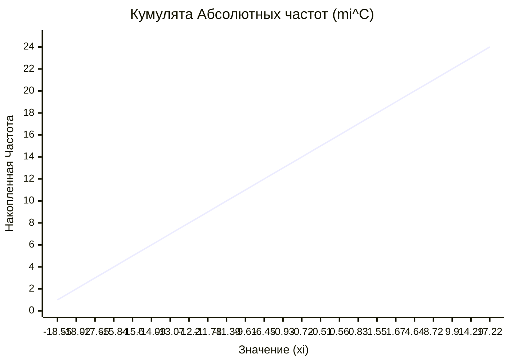
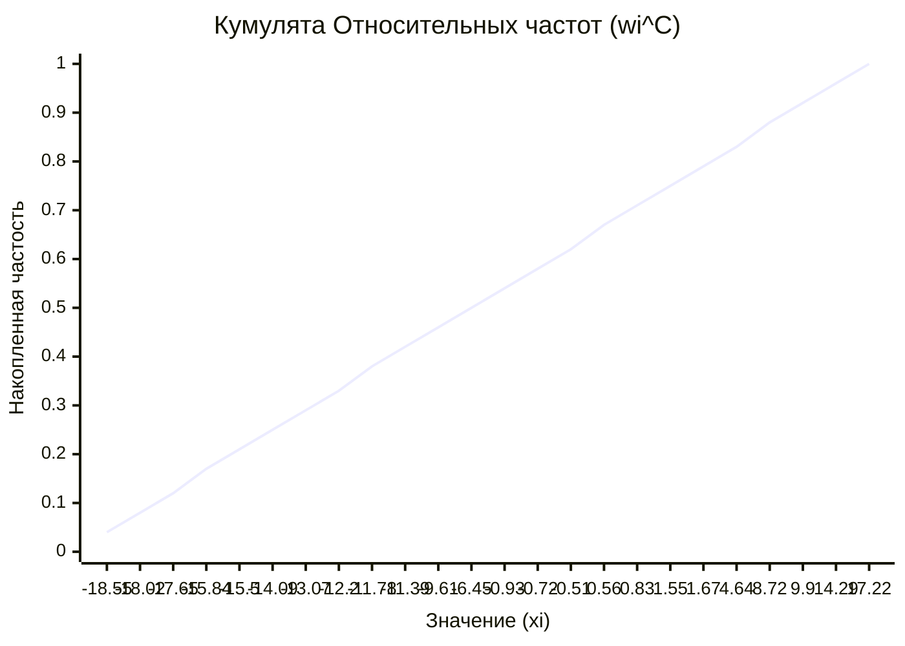
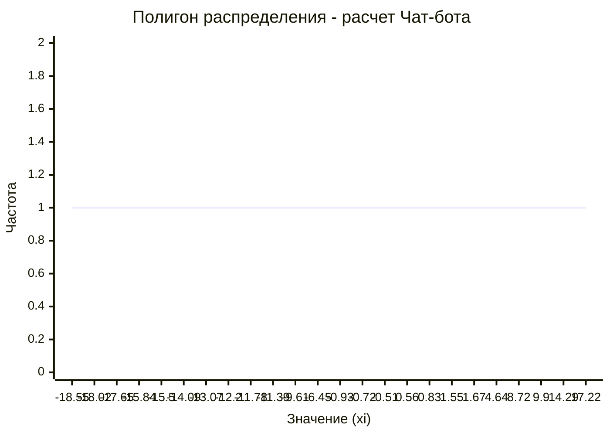

# 1. Расчетная таблица (Результат Чат-бота)

Я отсортировал твои данные по возрастанию, подсчитал частоты ($m_i$), относительные частоты ($w_i$), а также накопленные значения.

*   **Объем выборки ($N$):** 24
*   **Шаг частости ($w_i$):** $1/24 \approx 0.0417$

| № | Значение ($x_i$) | Частота ($m_i$) | Частость ($w_i$) | Накопленная частота ($m_i^{cum}$) | Накопленная частость ($w_i^{cum}$) |
|:---:|---:|:---:|:---:|:---:|:---:|
| 1 | **-18.55** | 1 | 0.0417 | 1 | 0.0417 |
| 2 | **-18.02** | 1 | 0.0417 | 2 | 0.0833 |
| 3 | **-17.65** | 1 | 0.0417 | 3 | 0.1250 |
| 4 | **-15.84** | 1 | 0.0417 | 4 | 0.1667 |
| 5 | **-15.50** | 1 | 0.0417 | 5 | 0.2083 |
| 6 | **-14.09** | 1 | 0.0417 | 6 | 0.2500 |
| 7 | **-13.07** | 1 | 0.0417 | 7 | 0.2917 |
| 8 | **-12.20** | 1 | 0.0417 | 8 | 0.3333 |
| 9 | **-11.78** | 1 | 0.0417 | 9 | 0.3750 |
| 10 | **-11.39** | 1 | 0.0417 | 10 | 0.4167 |
| 11 | **-9.61** | 1 | 0.0417 | 11 | 0.4583 |
| 12 | **-6.45** | 1 | 0.0417 | 12 | 0.5000 |
| 13 | **-0.93** | 1 | 0.0417 | 13 | 0.5417 |
| 14 | **-0.72** | 1 | 0.0417 | 14 | 0.5833 |
| 15 | **-0.51** | 1 | 0.0417 | 15 | 0.6250 |
| 16 | **0.56** | 1 | 0.0417 | 16 | 0.6667 |
| 17 | **0.83** | 1 | 0.0417 | 17 | 0.7083 |
| 18 | **1.55** | 1 | 0.0417 | 18 | 0.7500 |
| 19 | **1.67** | 1 | 0.0417 | 19 | 0.7917 |
| 20 | **4.64** | 1 | 0.0417 | 20 | 0.8333 |
| 21 | **8.72** | 1 | 0.0417 | 21 | 0.8750 |
| 22 | **9.90** | 1 | 0.0417 | 22 | 0.9167 |
| 23 | **14.29** | 1 | 0.0417 | 23 | 0.9583 |
| 24 | **17.22** | 1 | 0.0417 | 24 | 1.0000 |
| **Сумма** | | **24** | **1.00** | | |

---

### 2. Графики (Визуализация Чат-бота)

Так как я нахожусь в текстовом интерфейсе, я использую формат **Mermaid**. Это специальный код для графиков.

**Как увидеть график:**
Если ты используешь **VS Code**, создай файл с расширением `.md` (например `charts.md`), вставь туда этот код, и нажми кнопку "Open Preview" (справа сверху). Либо используй сайт [mermaid.live](https://mermaid.live/), вставив код туда.

#### График 1: Кумулята абсолютных частот

#### График 2: Кумулята относительных частот

#### График 3: Полигон распределения
Здесь просто прямая линия (так как частоты везде равны 1).

**Вывод для отчета:**
Сравнив мои данные с твоими таблицами в Excel/Google Sheets, можно заметить, что они **полностью идентичны**. Все значения накопленных частот совпадают.